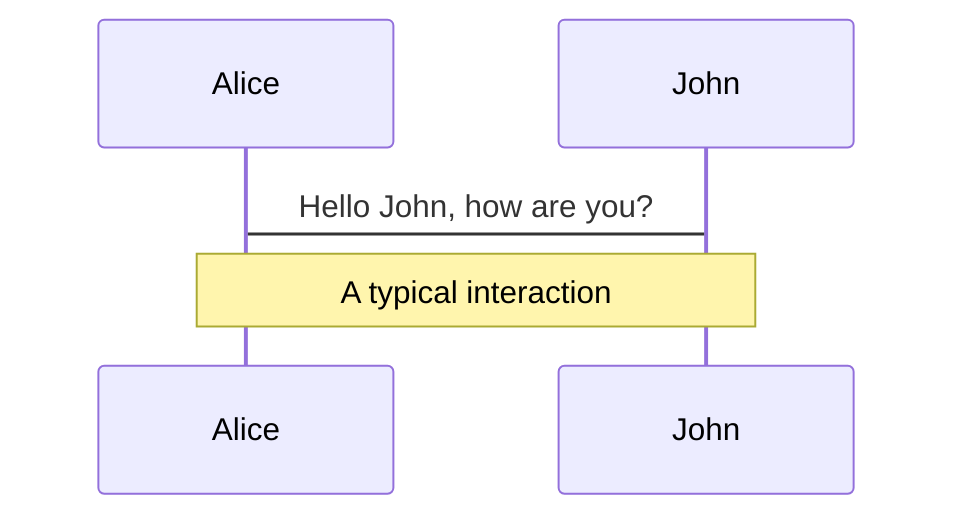
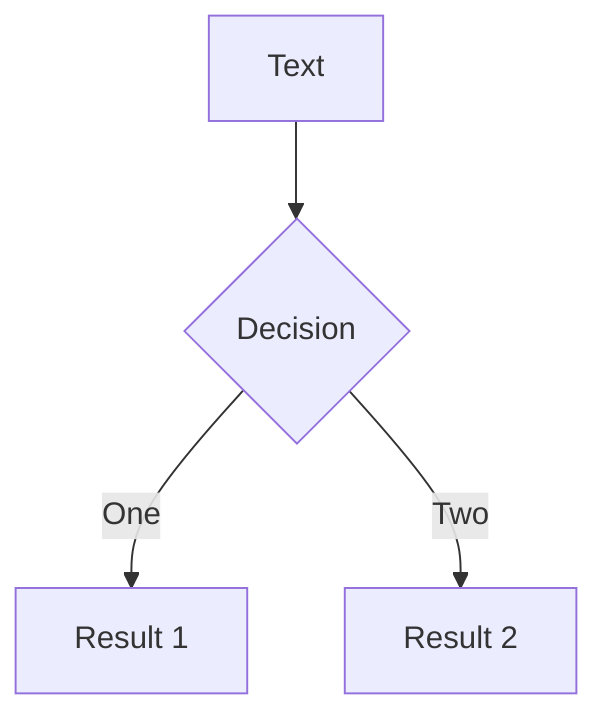

# 初识 Jest
<p class="mx-56 author">———— 赵昌柱</p>

---

# 背景介绍
- TS, Flow, EsLint, StyleLint 等前端工具都可以帮助减少 bug 产生. 
- 引入自动化测试可以更好地降低 bug 产生的可能性.
- 流行开源库都使用自动化测试. 多人协作时可以保证代码不会被意外修改.
- 在迭代旧项目时, 如果有自动化测试, 在修bug或增加新功能时, 可以保证不会影响之前的功能.
- 测试主要分为单元测试, 集成测试, end-to-end测试(端到端测试).

---

# 目录
- Jest 环境搭建及配置
- 基础 API
- 异步测试
- Mock
- Dom 测试
- 快照

---

# 测试原理
### 待测代码
```javascript {6-9}
/**
 * 格式化数字
 * @param {string|number} numStr 传入小于2位数的数值或字符串表示的数值
 * @returns 不足2位数时, 前面补0
 */
function formatNumStr(numStr) {
    numStr = typeof numStr === 'string' ? numStr : numStr.toString();
    return numStr.length === 2 ? numStr : `0${numStr}`;
}

module.exports = formatNumStr;

```

---

### 手工测试
```javascript {4-8,10-14}
let expected = '';
let result = '';

expected = '04';
result = formatNumStr(4);
if (result !== expected) {
    throw new Error(`formatNumStr(4) 应该等于 ${expected}, 但实际结果是 ${result}`);
}

expected = '12';
result = formatNumStr(12);
if (result !== expected) {
    throw new Error(`formatNumStr(12) 应该等于 ${expected}, 但实际结果是 ${result}`);
}

console.log("pass");
```
---

### 手工测试 (封装测试函数)
```javascript {18-23}
// expect(real).toBe(expected);
function expect(actual) {
    return {
        toBe(expected) {
            if (actual !== expected) { throw new Error("预期是 ${expected}, 实际结果是 ${result}"); }
        }
    }
}
function test(desc, fn) {
    try {
        fn();
        console.log(`${desc} pass`);
    } catch (error) {
        console.log(`${desc} failed, ${error.message}`);
    }
}

test('formatNumStr(4)', () => {
    expect(formatNumStr(4)).toBe('04');
});
test('formatNumStr(12)', () => {
    expect(formatNumStr(12)).toBe('12');
});
```

---

# 测试框架对比与选择


---

# Jest 优点
官网: [https://jestjs.io/](https://jestjs.io/)
- 速度快 (仅执行改变的代码)
- API简单
- 易配置 (开箱即用)
- 隔离性好
- 监控模式
- IDE整合
- Snapshot
- 多项目并行
- 覆盖率
- Mock 丰富

---

# Jest 环境搭建
1. 安装 Node.js
2. `npm install --save-dev jest`
3. 导出待测代码, 在测试文件中引入 (如果不编译, 直接在浏览器中使用的代码, 通过 `try...catch...` 导出)
4. 添加 script, `test: "jest"`

<br>
<br>

### 测试代码与之前相同
```javascript
const formatNumStr = require('./math');

test('formatNumStr(4)', () => {
    expect(formatNumStr(4)).toBe('04');
});
test('formatNumStr(12)', () => {
    expect(formatNumStr(12)).toBe('12');
});
```

---

# Jest 配置
1. 可以零配置运行
2. 生成配置文件 `npx jest --init`
3. watch 模式, `--watch` or `--watchAll`
4. 生成测试覆盖率报告, `--coverage` 和 `coverageDirectory`
5. 👉 配置 [Ref](https://jestjs.io/docs/configuration)
6. 支持 ESM  
    ### 安装 Babel
    ```bash
    yarn add --dev babel-jest @babel/core @babel/preset-env
    ```
    ### 配置 Babel
    ```javascript
    // babel.config.js
    module.exports = {
        presets: [['@babel/preset-env', {targets: {node: 'current'}}]],
    };
    ```

---
layout: two-cols
---

# 匹配器

- 通用
  - `.toBe(value)`
  - `.toEqual(value)`
  - `.not`
- 真假
  - `.toBeNull()`
  - `.toBeUndefined()`
  - `.toBeDefined()`
  - `.toBeTruthy()`
  - `.toBeFalsy()`

::right::

- 数字
  - `.toBeGreaterThan(number | bigint)`
  - `.toBeGreaterThanOrEqual(number | bigint)`
  - `.toBeLessThan(number | bigint)`
  - `.toBeLessThanOrEqual(number | bigint)`
  - `.toBeCloseTo(number, numDigits?)`
- 字符串
  - `.toMatch(regexp | string)`
- 数组
  - `.toContain(item)`
- 异常
  - `.toThrow(error?)`

<br>

👉 匹配器 [Guide](https://jestjs.io/docs/using-matchers), [Ref](https://jestjs.io/docs/expect)


<!-- # 命令行的使用 (可选) -->

---
layout: two-cols
---

# 测试异步代码

### 待测代码, 传统回调形式
```javascript{3-6}
function fetchData1(callback) {
    // do something
    setTimeout(() => {
        const data = "some data";
        callback(data);
    }, 500);
}
```

### 待测代码, Promise形式
```javascript{3-9}
function fetchData2(fakeError) {
    // do something
    return new Promise((resolve, reject) => {
        setTimeout(() => {
            const data = "some data";
            if (fakeError) reject(new Error("fake error"));
            else resolve(data);
        }, 500);
    });
}
```

::right::

## 错误的测试方式

### 回调形式
```javascript{2-4}
test.only('the data is "some data" (错误的方式1)', () => {
    fetchData1((data) => {
        expect(data).toBe("some data2");
    });
});
```

### Promise 形式
```javascript{2-4}
test.only('the data is "some data" (错误的方式2)', () => {
    fetchData2().then((data) => {
        expect(data).toBe("some data2");
    });
});
```

---

## 测试异步代码 - 方式1
### 方式1: 使用回调参数 done
```javascript{1,3-4}
test('the data is "some data" (done)', (done) => {
    fetchData1((data) => {
        expect(data).toBe("some data2");
        done();
    });
});
```

### 方式1: 使用回调参数 done (优化)
```javascript{1,3-8}
test('the data is "some data" (done (优化))', (done) => {
    fetchData1((data) => {
        try {
            expect(data).toBe("some data2");
            done();
        } catch (error) {
            done(error);
        }
    });
});
```

---
layout: two-cols
---

## 测试异步代码 - 方式2
### 方式2: 通过返回 promise
```javascript{2-4}
test('the data is "some data" (返回 promise)', () => {
    return fetchData2().then((data) => {
        expect(data).toBe("some data");
    });
});
```

### 方式2: 通过返回 promise (简化)
```javascript{2}
test('the data is "some data" (返回 promise (简化))', () => {
    return expect(fetchData2()).resolves.toBe("some data2");
});
```

::right::

### 方式2: 测试异常情况
```javascript{2-5,9}
test('error occur (返回 promise)', () => {
    expect.assertions(1);
    return fetchData2(true).catch((err) => {
        expect(err.toString()).toMatch("fake error");
    });
});

test('error occur (返回 promise (简化))', () => {
    return expect(fetchData2(true)).rejects.toThrow("fake error");
});
```

---

## 测试异步代码 - 方式3
### 方式3: 使用 async/await
```javascript{1-2}
test('the data is "some data" (使用 async/await)', async () => {
    await expect(fetchData2()).resolves.toBe("some data");
})
```
<br>
<br>

### 方式2: 测试异常情况
```javascript{1-2}
test('error occur (使用 async/await)', async () => {
    await expect(fetchData2(true)).rejects.toThrow("fake error");
});
```
<br>
<br>

👉 异步 [Guide](https://jestjs.io/docs/asynchronous), [Example](https://jestjs.io/docs/tutorial-async)

---
layout: two-cols
---

# 钩子函数
执行一些初始化, 清理等工作

- 针对单个测试
  - `beforeEach()`
  - `afterEach()`
- 针对全局
  - `beforeAll()`
  - `afterAll()`

<br>

👉 钩子函数 [Guide](https://jestjs.io/docs/setup-teardown)

::right::

```javascript
beforeAll (() => console.log('1 - beforeAll'));
afterAll  (() => console.log('1 - afterAll'));
beforeEach(() => console.log('1 - beforeEach'));
afterEach (() => console.log('1 - afterEach'));
test  ('', () => console.log('1 - test'));
describe('Scoped / Nested block', () => {
    beforeAll (() => console.log('2 - beforeAll'));
    afterAll  (() => console.log('2 - afterAll'));
    beforeEach(() => console.log('2 - beforeEach'));
    afterEach (() => console.log('2 - afterEach'));
    test  ('', () => console.log('2 - test'));
});
```
```txt
1 - beforeAll
1 - beforeEach
1 - test
1 - afterEach
2 - beforeAll
1 - beforeEach
2 - beforeEach
2 - test
2 - afterEach
1 - afterEach
2 - afterAll
1 - afterAll
```

---

# 作用域
- 默认情况下, 作用于整个测试文件
- 如果使用 `describe` 对测试进行了分组, 则只在该 `describe` 块下有效
- 通过例子了解执行顺序
- 通过例子了解直接写在 describe 中的代码与钩子函数的代码的执行顺序

---
layout: two-cols
---

```javascript
describe('outer', () => {
    console.log('describe outer-a');
    describe('describe inner 1', () => {
        console.log('describe inner 1');
        test('test 1', () => {
            console.log('test for describe inner 1');
            expect(true).toEqual(true);
        });
    });
    console.log('describe outer-b');
    test('test 1', () => {
        console.log('test for describe outer');
        expect(true).toEqual(true);
    });
    describe('describe inner 2', () => {
        console.log('describe inner 2');
        test('test for describe inner 2', () => {
            console.log('test for describe inner 2');
            expect(false).toEqual(false);
        });
    });
    console.log('describe outer-c');
});
```

::right::

```txt
// describe outer-a
// describe inner 1
// describe outer-b
// describe inner 2
// describe outer-c
// test for describe inner 1
// test for describe outer
// test for describe inner 2
```

---

# Mock
- mock 通过抹去函数的实现细节来测试代码之间的联系.
- 捕获对函数的调用, 调用时传递的参数, new 的实例, 还可以配置返回值.
- 单元测试中, 为了消除其他模块对待测模块的影响, 需要对其他模块进行 mock.
- 有两种 mock 方式:
    1. 直接在测试代码中创建
    2. 手动 mock 以覆盖模块依赖

<br>

👉 Mock [Guide](https://jestjs.io/docs/mock-functions)

---

## `.mock` 属性
- 通过调用 `jest.fn()` 即可创建一个 mock 函数
- 所有 mock 函数都有一个 `.mock` 属性, 保存了函数调用和返回值的信息


```javascript{7,9}
function forEach(items, callback) {
    for (let index = 0; index < items.length; index++) {
        callback(items[index]);
    }
}

const mockCallback = jest.fn(x => 42 + x);
forEach([0, 1], mockCallback);
console.log(mockCallback.mock);
```

### console log

```json
{
    calls: [ [ 0 ], [ 1 ] ],
    instances: [ undefined, undefined ],
    invocationCallOrder: [ 1, 2 ],
    results: [ { type: 'return', value: 42 }, { type: 'return', value: 43 } ]
}
```

---
layout: two-cols
---

## mock 返回值
- `mockFn.mockReturnThis()`
- `mockFn.mockReturnValue(value)`
- `mockFn.mockReturnValueOnce(value)`
- `mockFn.mockResolvedValue(value)`
- `mockFn.mockResolvedValueOnce(value)`
- `mockFn.mockRejectedValue(value)`
- `mockFn.mockRejectedValueOnce(value)`

::right::

```javascript
test("mock return value", () => {
    const myMock = jest.fn();

    console.log(myMock());
    // > undefined

    myMock.mockReturnValueOnce(10)
        .mockReturnValueOnce('x')
        .mockReturnValue(true);

    console.log(myMock(), myMock(), myMock(), myMock());
    // > 10, 'x', true, true
});
```


---

# snapshot

---

# Mock Timers (可选)

---

# ES6 类的测试

---

# DOM 测试

---

# AngularJS


---

---
# try also 'default' to start simple
theme: seriph
# random image from a curated Unsplash collection by Anthony
# like them? see https://unsplash.com/collections/94734566/slidev
background: https://source.unsplash.com/collection/94734566/1920x1080
# apply any windi css classes to the current slide
class: 'text-center'
# https://sli.dev/custom/highlighters.html
highlighter: shiki
# some information about the slides, markdown enabled
info: |
  ## Slidev Starter Template
  Presentation slides for developers.

  Learn more at [Sli.dev](https://sli.dev)
---

# Welcome to Slidev

Presentation slides for developers

<div class="pt-12">
  <span @click="$slidev.nav.next" class="px-2 py-1 rounded cursor-pointer" hover="bg-white bg-opacity-10">
    Press Space for next page <carbon:arrow-right class="inline"/>
  </span>
</div>

<div class="abs-br m-6 flex gap-2">
  <button @click="$slidev.nav.openInEditor()" title="Open in Editor" class="text-xl icon-btn opacity-50 !border-none !hover:text-white">
    <carbon:edit />
  </button>
  <a href="https://github.com/slidevjs/slidev" target="_blank" alt="GitHub"
    class="text-xl icon-btn opacity-50 !border-none !hover:text-white">
    <carbon-logo-github />
  </a>
</div>


<!--
The last comment block of each slide will be treated as slide notes. It will be visible and editable in Presenter Mode along with the slide. [Read more in the docs](https://sli.dev/guide/syntax.html#notes)
-->

---

# What is Slidev?

Slidev is a slides maker and presenter designed for developers, consist of the following features

- 📝 **Text-based** - focus on the content with Markdown, and then style them later
- 🎨 **Themable** - theme can be shared and used with npm packages
- 🧑‍💻 **Developer Friendly** - code highlighting, live coding with autocompletion
- 🤹 **Interactive** - embedding Vue components to enhance your expressions
- 🎥 **Recording** - built-in recording and camera view
- 📤 **Portable** - export into PDF, PNGs, or even a hostable SPA
- 🛠 **Hackable** - anything possible on a webpage

<br>
<br>

Read more about [Why Slidev?](https://sli.dev/guide/why)

<!--
You can have `style` tag in markdown to override the style for the current page.
Learn more: https://sli.dev/guide/syntax#embedded-styles
-->

<style>
h1 {
  background-color: #2B90B6;
  background-image: linear-gradient(45deg, #4EC5D4 10%, #146b8c 20%);
  background-size: 100%;
  -webkit-background-clip: text;
  -moz-background-clip: text;
  -webkit-text-fill-color: transparent; 
  -moz-text-fill-color: transparent;
}
</style>

---

# Navigation

Hover on the bottom-left corner to see the navigation's controls panel, [learn more](https://sli.dev/guide/navigation.html)

### Keyboard Shortcuts

|                                                     |                             |
| --------------------------------------------------- | --------------------------- |
| <kbd>right</kbd> / <kbd>space</kbd>                 | next animation or slide     |
| <kbd>left</kbd>  / <kbd>shift</kbd><kbd>space</kbd> | previous animation or slide |
| <kbd>up</kbd>                                       | previous slide              |
| <kbd>down</kbd>                                     | next slide                  |

<!-- https://sli.dev/guide/animations.html#click-animations -->

<p v-after class="absolute bottom-23 left-45 opacity-30 transform -rotate-10">Here!</p>

---
layout: image-right
image: https://source.unsplash.com/collection/94734566/1920x1080
---

# Code

Use code snippets and get the highlighting directly![^1]

```ts {all|2|1-6|9|all}
interface User {
  id: number
  firstName: string
  lastName: string
  role: string
}

function updateUser(id: number, update: User) {
  const user = getUser(id)
  const newUser = {...user, ...update}  
  saveUser(id, newUser)
}
```

<arrow v-click="3" x1="400" y1="420" x2="230" y2="330" color="#564" width="3" arrowSize="1" />

[^1]: [Learn More](https://sli.dev/guide/syntax.html#line-highlighting)

<style>
.footnotes-sep {
  margin-top: 5em;
}
.footnotes {
  @apply text-sm opacity-75;
}
.footnote-backref {
  display: none;
}
</style>

---

# Components

<div grid="~ cols-2 gap-4">
<div>

You can use Vue components directly inside your slides.

We have provided a few built-in components like `<Tweet/>` and `<Youtube/>` that you can use directly. And adding your custom components is also super easy.

```html
<Counter :count="10" />
```

<!-- ./components/Counter.vue -->
<Counter :count="10" m="t-4" />

Check out [the guides](https://sli.dev/builtin/components.html) for more.

</div>
<div>

```html
<Tweet id="1390115482657726468" />
```

<Tweet id="1390115482657726468" scale="0.65" />

</div>
</div>


---
class: px-20
---

# Themes

Slidev comes with powerful theming support. Themes can provide styles, layouts, components, or even configurations for tools. Switching between themes by just **one edit** in your frontmatter:

<div grid="~ cols-2 gap-2" m="-t-2">

```yaml
---
theme: default
---
```

```yaml
---
theme: seriph
---
```


</div>

Read more about [How to use a theme](https://sli.dev/themes/use.html) and
check out the [Awesome Themes Gallery](https://sli.dev/themes/gallery.html).

---
preload: false
---

# Animations

Animations are powered by [@vueuse/motion](https://motion.vueuse.org/).

```html
<div
  v-motion
  :initial="{ x: -80 }"
  :enter="{ x: 0 }">
  Slidev
</div>
```

<div class="w-60 relative mt-6">
  <div class="relative w-40 h-40">
    
    
    
  </div>

  <div 
    class="text-5xl absolute top-14 left-40 text-[#2B90B6] -z-1"
    v-motion
    :initial="{ x: -80, opacity: 0}"
    :enter="{ x: 0, opacity: 1, transition: { delay: 2000, duration: 1000 } }">
    Slidev
  </div>
</div>

<!-- vue script setup scripts can be directly used in markdown, and will only affects current page -->
<script setup lang="ts">
const final = {
  x: 0,
  y: 0,
  rotate: 0,
  scale: 1,
  transition: {
    type: 'spring',
    damping: 10,
    stiffness: 20,
    mass: 2
  }
}
</script>

<div
  v-motion
  :initial="{ x:35, y: 40, opacity: 0}"
  :enter="{ y: 0, opacity: 1, transition: { delay: 3500 } }">

[Learn More](https://sli.dev/guide/animations.html#motion)

</div>

---

# LaTeX

LaTeX is supported out-of-box powered by [KaTeX](https://katex.org/).

<br>

Inline $\sqrt{3x-1}+(1+x)^2$

Block
$$
\begin{array}{c}

\nabla \times \vec{\mathbf{B}} -\, \frac1c\, \frac{\partial\vec{\mathbf{E}}}{\partial t} &
= \frac{4\pi}{c}\vec{\mathbf{j}}    \nabla \cdot \vec{\mathbf{E}} & = 4 \pi \rho \\

\nabla \times \vec{\mathbf{E}}\, +\, \frac1c\, \frac{\partial\vec{\mathbf{B}}}{\partial t} & = \vec{\mathbf{0}} \\

\nabla \cdot \vec{\mathbf{B}} & = 0

\end{array}
$$

<br>

[Learn more](https://sli.dev/guide/syntax#latex)

---

# Diagrams

You can create diagrams / graphs from textual descriptions, directly in your Markdown.

<div class="grid grid-cols-2 gap-10 pt-4 -mb-6">





</div>

[Learn More](https://sli.dev/guide/syntax.html#diagrams)


---
layout: center
class: text-center
---

# Learn More

[Documentations](https://sli.dev) · [GitHub](https://github.com/slidevjs/slidev) · [Showcases](https://sli.dev/showcases.html)
